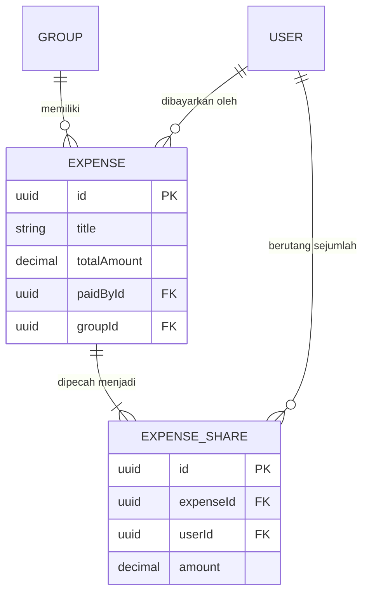
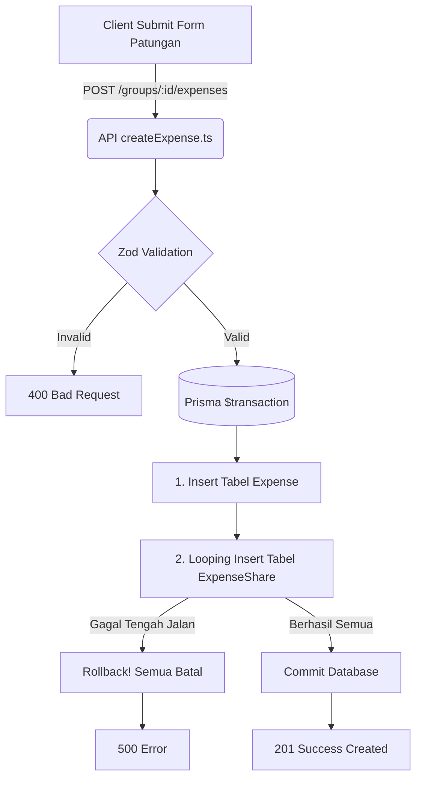

# 💸 Expenses Module

Modul ini bertugas menangani pencatatan tagihan (patungan) di dalam sebuah grup. Fitur ini memungkinkan pengguna mencatat siapa yang membayar *bill* utama (misalnya di restoran), lalu membaginya ke anggota lain yang ikut berutang.

## 📂 Struktur File

| File | Fungsi Utama |
|------|-------------|
| `createExpense.ts` | Menyimpan transaksi pengeluaran baru. Termasuk membuat entri utama `Expense` dan rincian bagian masing-masing anggota di tabel `ExpenseShare`. |
| `getExpenses.ts` | Mengambil daftar riwayat pengeluaran dari sebuah grup (biasanya disajikan secara kronologis). |
| `getExpenseDetail.ts` | Mengambil informasi sangat rinci dari satu transaksi tagihan (termasuk siapa saja yang terlibat dan berapa nominal mereka). |
| `updateExpense.ts` | Mengubah rincian tagihan (misalnya jika ada koreksi harga, atau penambahan/pengurangan anggota yang ikut patungan). |
| `deleteExpense.ts` | Menghapus catatan tagihan sepenuhnya secara permanen. |

## 🔌 API Endpoints

- `POST /groups/:id/expenses` : Menambahkan tagihan baru ke sebuah grup.
- `GET /groups/:id/expenses` : Melihat riwayat seluruh tagihan di dalam grup.
- `GET /expenses/:id` : Melihat detail spesifik satu tagihan.
- `PUT /expenses/:id` : Mengedit tagihan yang ada.
- `DELETE /expenses/:id` : Menghapus tagihan.

## 🔄 Alur Data (Data Flow)

Berikut adalah visualisasi cara kerja **Create Expense**, yang menggunakan sistem *Prisma Transaction* untuk memastikan data Konsisten (Jika `ExpenseShare` gagal disimpan, `Expense` utama otomatis batal/dihapus).

