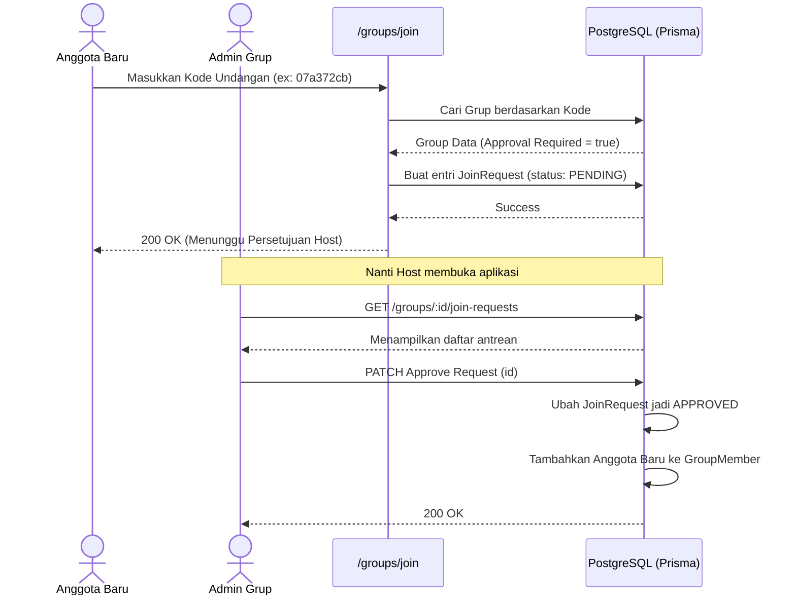

# Groups Module

Modul ini adalah pusat dari fitur aplikasi, di mana para pengguna membentuk kelompok ("Sirkel") untuk mencatat tagihan patungan.

## Struktur File

| File | Fungsi Utama |
|------|-------------|
| `createGroup.ts` | Membuat grup baru, mencetak kode undangan rahasia, dan menetapkan sang pembuat sebagai *Host*. |
| `joinGroup.ts` | Memproses pengguna yang ingin masuk ke grup menggunakan kode undangan rahasia (langsung masuk atau masuk antrean/Pendeing). |
| `joinRequests.ts` | Endpoint khusus *Host* untuk melihat daftar *Request* masuk dan menyetujui atau menolaknya. |
| `getGroupDetails.ts` | Mengambil detail informasi dasar dari grup tertentu (nama, kode, admin). |
| `getGroupMembers.ts` | Mengambil daftar seluruh anggota yang ada di dalam sebuah grup. |
| `getGroupBalance.ts` | Mesin penghitung otomatis yang mengakumulasi utang dan piutang tiap anggota grup untuk merangkum total *balance*. |
| `groupSettings.ts` | Mengubah pengaturan grup seperti nama, kode undangan baru, atau aturan *approval*. |

## API Endpoints

- `POST /groups` : Membuat grup baru.
- `POST /groups/join` : Mengajukan permintaan gabung dengan grup.
- `GET /groups/:id` : Mendapatkan detail grup.
- `PATCH /groups/:id` : Memperbarui pengaturan grup.
- `GET /groups/:id/members` : Mendapatkan daftar anggota.
- `GET /groups/:id/balance` : Mendapatkan rekap utang (*balance*).
- `GET /groups/:id/join-requests` : Daftar antrean bergabung.
- `PATCH /groups/:id/join-requests/:requestId` : Setujui/Tolak anggota baru.

## Alur Data (Data Flow)

Berikut adalah visualisasi alur bagaimana anggota baru bergabung ke dalam sebuah grup (dengan fitur *Host Approval* aktif).

