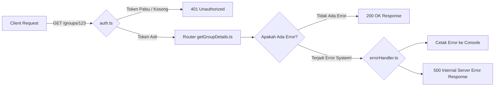

# Middleware Module

Modul ini tidak berisi API Endpoints, melainkan fungsi-fungsi penyaring (*filter*) yang berjalan di tengah-tengah alur *Request - Response*. Fungsinya untuk menjaga keamanan dan ketahanan aplikasi.

## Struktur File

| File | Fungsi Utama |
|------|-------------|
| `auth.ts` | Penyaring (Satpam) Utama. Mengekstrak Token JWT dari *Header* HTTP (`Authorization: Bearer <token>`), memverifikasinya dengan `jsonwebtoken`, lalu meneruskan ID pengguna ke rute selanjutnya melalui variabel lokal (`res.locals.user`). |
| `errorHandler.ts` | Jaring Pengaman Global (*Global Error Handler*). Menangkap semua *Error* tak terduga (atau *Promise Rejections*) yang bocor dari aplikasi dan mengubahnya menjadi respons JSON `500 Internal Server Error` yang aman bagi *Frontend*. |

## Alur Data (Data Flow)

Berikut adalah visualisasi letak berdirinya *Middleware* di dalam siklus permintaan API.

