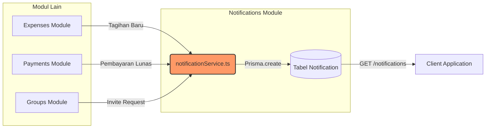

# Notifications Module

Modul ini adalah pusat kendali untuk semua pemberitahuan (notifikasi) yang dikirimkan ke *user*. Modul ini bekerja seperti tukang pos, menerima instruksi dari modul lain (seperti *Expenses* atau *Payments*) dan menyimpan pesan tersebut untuk dibaca oleh *user*.

## Struktur File

| File | Fungsi Utama |
|------|-------------|
| `notificationService.ts` | Berisi fungsi utilitas (`createNotification`) yang bisa dipanggil oleh modul lain dari mana saja untuk menghasilkan notifikasi baru ke *Database*. |
| `getNotifications.ts` | *Endpoint* bagi *user* untuk menarik (*fetch*) daftar notifikasi mereka, serta *endpoint* untuk menandai notifikasi sebagai "Sudah Dibaca" (*Mark as Read*). |
| `joinRequestNotifications.ts` | *Endpoint* khusus (*shortcut*) untuk mengambil notifikasi yang jenisnya `JOIN_REQUEST`, memisahkan notifikasi umum dengan notifikasi permintaan bergabung ke dalam grup. |

## API Endpoints

- `GET /notifications` : Mengambil semua notifikasi milik *user* yang sedang login.
- `PATCH /notifications/:id/read` : Menandai 1 notifikasi sebagai sudah dibaca.
- `PATCH /notifications/read-all` : Menandai seluruh notifikasi sebagai sudah dibaca.
- `GET /notifications/join-requests` : Mengambil khusus notifikasi tipe "Permintaan Bergabung".

## Alur Data (Data Flow)

Berikut adalah visualisasi bagaimana `notificationService.ts` bekerja secara tidak langsung di belakang layar (*background/side-effect*).

