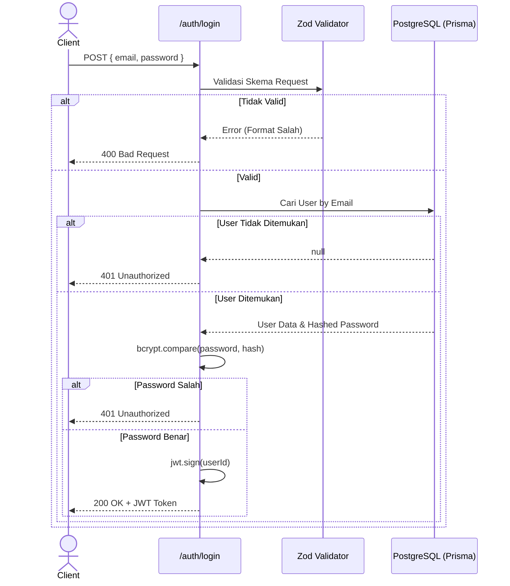

# Users Module

Modul ini bertanggung jawab atas semua hal yang berkaitan dengan pengguna, mulai dari pendaftaran (registrasi), autentikasi (login), hingga pengambilan dan pembaruan profil pengguna.

## Struktur File

| File | Fungsi Utama |
|------|-------------|
| `registerUser.ts` | Menangani pendaftaran akun baru menggunakan email dan password. Password di-hash menggunakan `bcrypt`. |
| `loginUser.ts` | Memverifikasi kredensial pengguna dan menerbitkan JWT (JSON Web Token) untuk autentikasi sesi. |
| `googleAuth.ts` | Menangani pendaftaran dan login (SSO) menggunakan akun Google OAuth. |
| `profile.ts` | Mengambil data profil pengguna yang sedang login dan memperbarui informasi profil mereka. |

## API Endpoints

- `POST /auth/register` : Mendaftarkan akun baru.
- `POST /auth/login` : Masuk dan mendapatkan JWT.
- `POST /auth/google` : Masuk/Daftar menggunakan token Google.
- `GET /users/me` : Mengambil informasi profil (butuh Token).
- `PATCH /users/me` : Memperbarui nama profil pengguna (butuh Token).

## Alur Data (Data Flow)

Berikut adalah alur autentikasi dan pembuatan sesi JWT saat pengguna mencoba masuk (*Login*).

