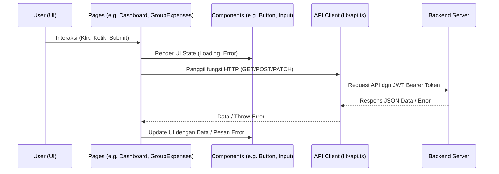

# Direktori Frontend Source (`src`)

Direktori ini berisi seluruh kode sumber (source code) aplikasi React (Frontend). Struktur di dalamnya mengikuti pola pemisahan tanggung jawab yang rapi agar kode mudah dipelihara.

## Daftar Direktori dan File Utama

- **`components/`**: Berisi komponen-komponen UI yang dapat digunakan kembali (reusable) di berbagai halaman, seperti `Button`, `Input`, dsb.
- **`lib/`**: Berisi modul-modul utilitas, seperti konfigurasi koneksi API (Axios).
- **`pages/`**: Berisi komponen-komponen React yang bertindak sebagai "Halaman" aplikasi (berdasarkan rute URL).
- **`App.tsx`**: Komponen utama yang mengatur sistem Routing (pindah halaman) menggunakan `react-router-dom`.
- **`main.tsx`**: Entry point (titik awal) aplikasi React yang mem-booting aplikasi dan menyuntikkan Context Providers (seperti Google OAuth).
- **`index.css`**: File CSS utama (Vanilla CSS) yang mendefinisikan seluruh variabel gaya (design tokens), tema, tipografi, dan gaya utilitas global.

## Alur Data Secara Umum (Visualisasi)

1. **User** berinteraksi dengan antarmuka di sebuah Halaman (di `pages/`).
2. Komponen Halaman kemudian memanggil *instance* Axios tersentralisasi yang ada di `lib/api.ts`.
3. **API Client** secara otomatis menyuntikkan kredensial (Token JWT) dan meneruskannya ke Backend.
4. Data yang kembali ditangkap oleh Halaman, dan *state* React di-update.
5. Halaman memberikan instruksi ke **Components** untuk melakukan perubahan tampilan (seperti mematikan ikon loading, atau menampilkan daftar utang).